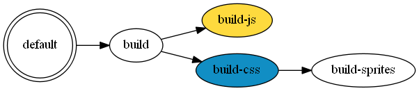

gulp-graphviz-deps
=======

Generates a [*graphviz*](http://www.graphviz.org/) document of your gulp tasks' dependencies

Usage
-----
Imagine you have the following gulpfile.js

```js
var gulp = require('gulp');


// Add some tasks
gulp.task('default', ['build']);
gulp.task('build', ['build-js', 'build-css']);
gulp.task('build-js', function() {})
gulp.task('build-css', ['build-sprites'], function() {})
gulp.task('build-sprites', function() {})

```

But you want to view the dependencies graphically.

Run `npm install --save-dev gulp-graphviz-deps`	and add the following to your gulpfile.js

```diff
var gulp = require('gulp');
+var deps = require('gulp-graphviz-deps');

+// Add a task to render the output
+gulp.task('deps', function(){console.log(deps());});

// Add some tasks
gulp.task('default', ['build']);
gulp.task('build', ['build-js', 'build-css']);
gulp.task('build-js', function() {})
gulp.task('build-css', ['build-sprites'], function() {})
gulp.task('build-sprites', function() {})

```

Now run `gulp deps`, and you'll see this:

```plain
digraph Dependencies
{
    graph [rankdir="LR",tooltip=" "]

    "build" [fillcolor="white",style="filled"]
      "build" -> "build-js"
      "build" -> "build-css"

    "build-css" [fillcolor="#118EC4",style="filled"]
      "build-css" -> "build-sprites"

    "build-js" [fillcolor="#FEDA3E",style="filled"]

    "build-sprites" [fillcolor="white",style="filled"]

    "default" [fillcolor="white",shape="doublecircle",style="filled"]
      "default" -> "build"
}
```

This is [*graphviz*](http://www.graphviz.org/) code. Running the graphviz tool `dot` over this text will produce a graphical representation of this dependency graph:



Running Graphviz Automatically
-----

TODO

```
gulp.task('inception', ['compile'], function() {
    var myGraphViz = require('./index.js')();
    fs.writeFileSync('inception.txt', myGraphViz);
    console.log('Wrote my own dependencies as a graphviz document to inception.txt. I am about to try running dot over this file, if dot is not in the path this will fail');

    return gulp.src('inception.txt')
        .pipe(shell('dot inception.txt -O -Tpng -Tsvg'));
});
```

Configuration
-----

TODO
```js
interface Options {
	showTaskCodeAsTooltip?: boolean;
	styleRules?: StyleRule[];
	implicitDependencies?: StyleRule[];
	missingDependencyStyles?: Styles;
	graphStyles?: Styles;
}

interface StyleRule {
	matcher: RegExp;
	styles: Styles;
}

interface Styles {
	[s: string]: string;
}

var defaults = {
	showTaskCodeAsTooltip: true,
	styleRules: [
		{ matcher: /default/, styles: { shape: "doublecircle" } },
		{ matcher: /watch/, styles: { shape:"rarrow" } },
		{ matcher: /js|script|compile/, styles: { fillcolor: "#FEDA3E" } },
		{ matcher: /css|style|less|sass/, styles: { fillcolor: "#118EC4"} },
		{ matcher: /test|spec|unit/, styles: { fillcolor: "#B29259", shape:"tab" } }
	],
	implicitDependencies: [
		{ matcher: /gulp.watch\(\s*[^;]*?\[([^;]+)\]\s*\)/g, styles: { color: "#999999", style: "dashed"  } },
		{ matcher: /runSequence\(\s*\[([^;]+)\]\s*\)/g, styles: { color: "#ff9999", style: "dashed"  } }
	],
	missingDependencyStyles: { fillcolor: "red" },
	graphStyles: { rankdir:"LR", tooltip:" "}
}
```

